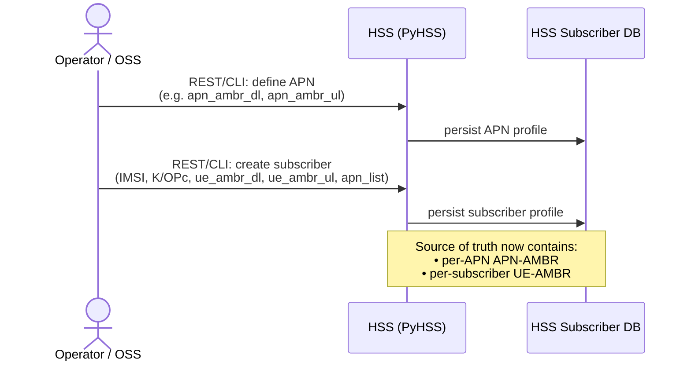
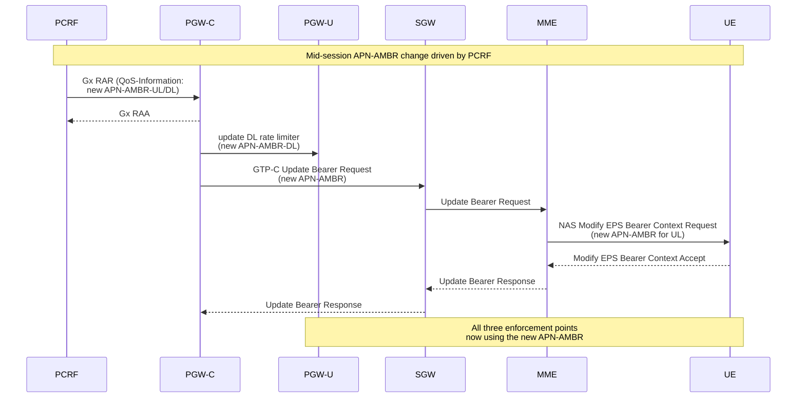
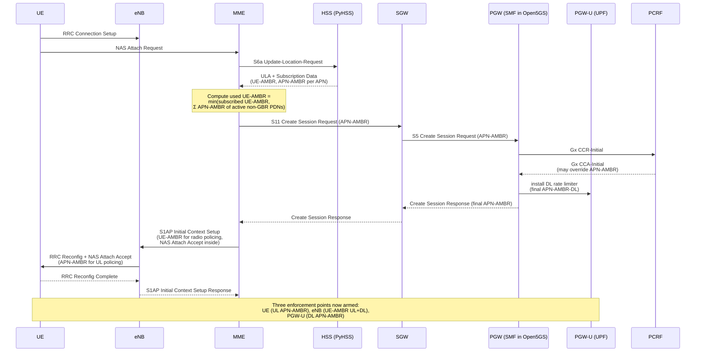
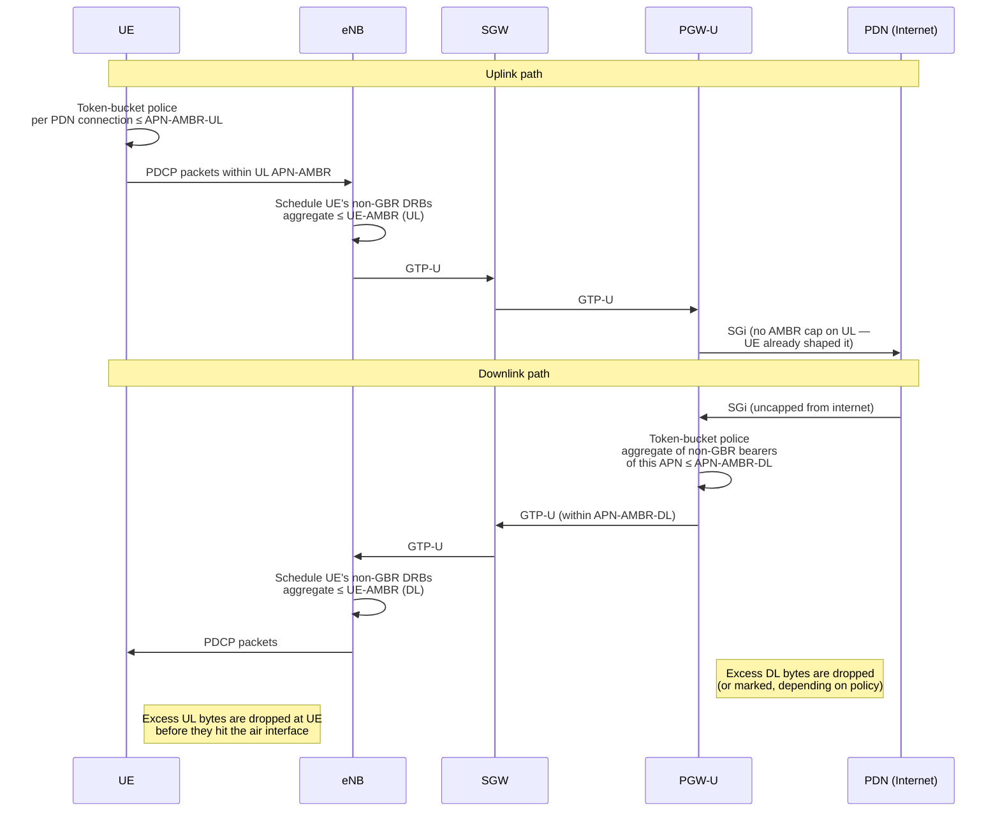
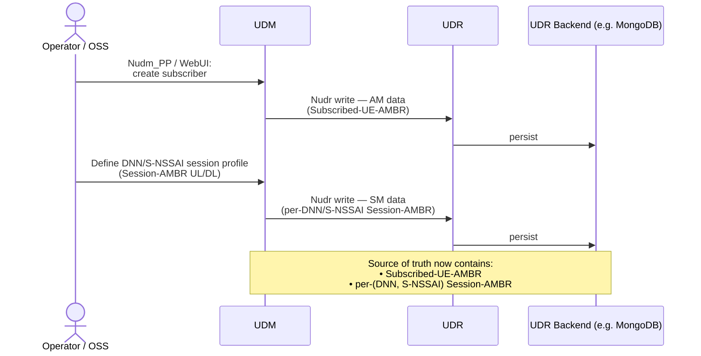
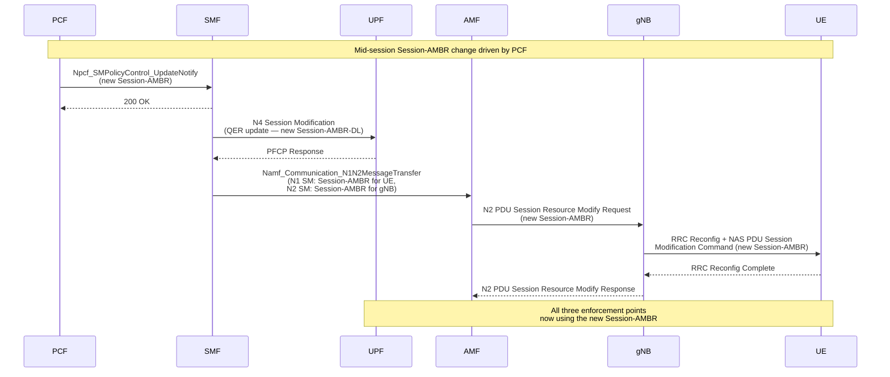
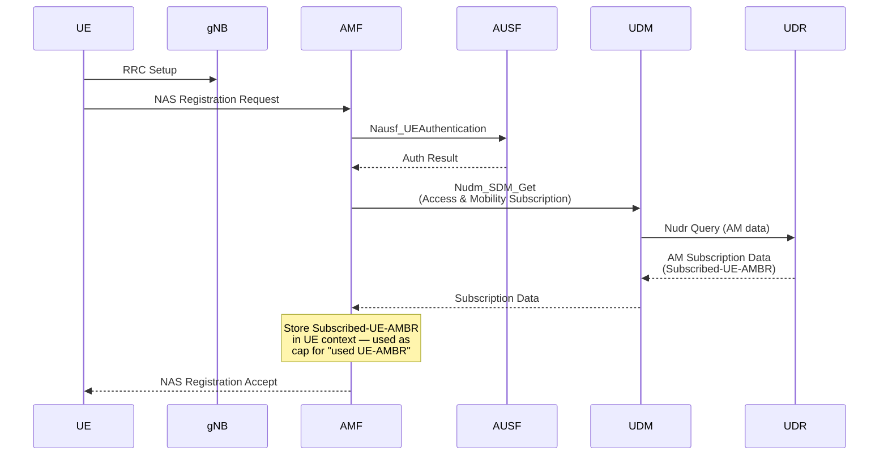
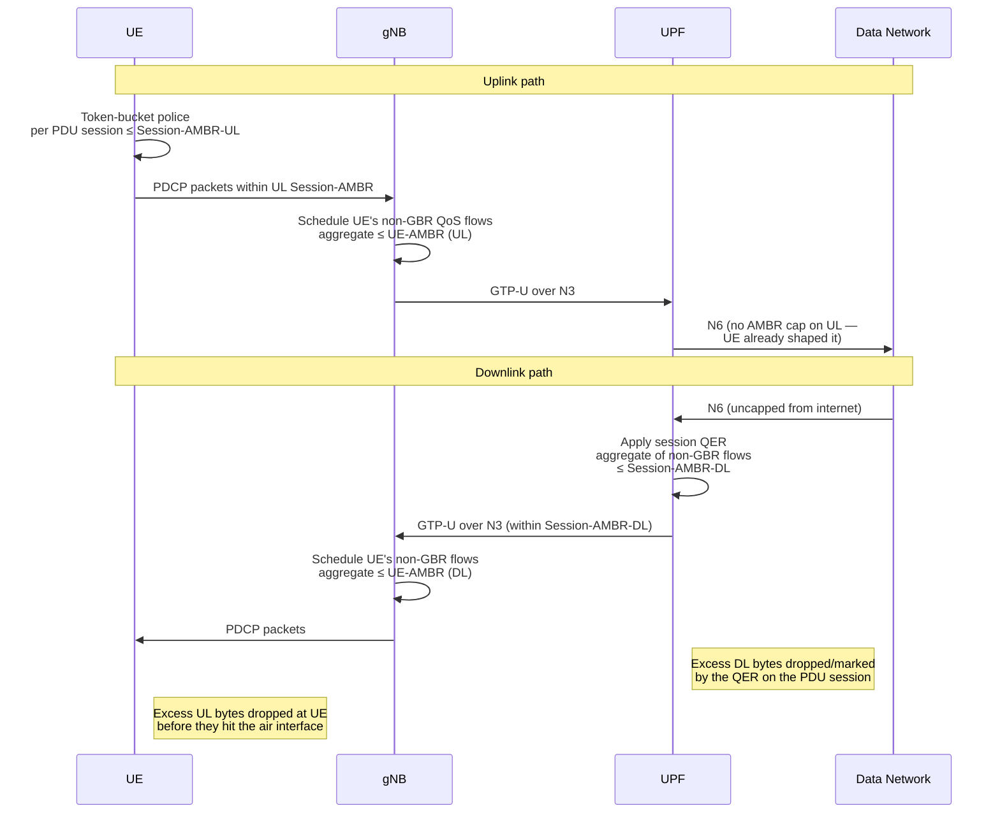

# AMBR end-to-end — 4G and 5G

A practical guide for both audiences:

- **Product managers** translating customer rate-cap requirements into a feature ask.
- **System architects** wiring the actual NF interactions and enforcement points.

AMBR (Aggregate Maximum Bit Rate) is how the network caps **non-GBR** traffic — best-effort data — at two scopes: per *session/APN* and per *subscriber*. GBR traffic (e.g. VoLTE/VoNR voice on QCI/5QI 1) is governed separately by per-flow MBR/GBR, not AMBR.

This document covers, for each generation:

1. The NFs involved and their role.
2. A simplified mental model.
3. How AMBR is **provisioned** (operator-side, before any UE shows up).
4. How it is **dynamically updated** by the policy NF (PCRF in 4G, PCF in 5G).
5. How it is **distributed** to all enforcement points during attach / registration.
6. How it is **enforced** at runtime.

---

## 1. AMBR scopes — naming cheat sheet

| Scope | 4G name | 5G name | Applies to |
|---|---|---|---|
| Per data network | **APN-AMBR** | **Session-AMBR** | All non-GBR bearers/flows of one APN/DNN |
| Per subscriber | **UE-AMBR** | **UE-AMBR** | All non-GBR bearers/flows of the UE on the radio |
| Per flow (not AMBR) | MBR / GBR | MBR / GBR | A single GBR bearer / QoS flow |

The semantics carry over cleanly between generations — the *plumbing* changes.

---

## 2. NFs involved per generation

### 4G (EPS) — APN-AMBR + UE-AMBR

| NF | Role in AMBR | Repo dir |
|---|---|---|
| **HSS (PyHSS)** | Subscription store. Holds **UE-AMBR** (per-subscriber) and **APN-AMBR** (per APN). Sends both to MME on attach via S6a `Update-Location-Answer`. | `network/pyhss`, `network/hss` |
| **PCRF** | Optional dynamic policy. Can override APN-AMBR over Gx (CCA-I / RAR) to PGW-C. Authoritative when present. | `network/pcrf` (and PyHSS PCRF) |
| **MME** | Computes the *used* UE-AMBR (min of subscribed UE-AMBR and the sum of APN-AMBRs across active non-GBR PDN connections). Pushes APN-AMBR to SGW/PGW via S11/S5 GTP-C `Create Session Request`, and pushes UE-AMBR to the eNB via S1AP `Initial Context Setup`. | `network/mme` |
| **SGW-C / SGW-U** | Pass-through. Carries the APN-AMBR IE on S11/S5 but does **not** enforce. | `network/sgwc`, `network/sgwu` |
| **PGW-C** (combined into Open5GS SMF) | Receives APN-AMBR from MME (and possibly PCRF). Programs PGW-U to enforce DL APN-AMBR; signals UL APN-AMBR back to UE via NAS. | `network/smf` (acts as SMF+PGW-C) |
| **PGW-U** (combined into Open5GS UPF) | **Enforcement point for APN-AMBR DL** on the SGi side, across the aggregate of non-GBR EPS bearers of that APN. | `network/upf` (acts as UPF+PGW-U) |
| **eNB** | **Enforcement point for UE-AMBR** (UL & DL on the radio, across all of the UE's non-GBR DRBs). | `network/srsenb`, `network/oai` |
| **UE** | **Enforcement point for APN-AMBR UL** per PDN connection, using the value the MME sent over NAS. | `network/srslte` (srsUE) |

### 5G (5GC) — Session-AMBR + UE-AMBR

| NF | Role in AMBR | Repo dir |
|---|---|---|
| **UDR** | Persistent subscription store. Holds **Subscribed-UE-AMBR** in AM data and **Session-AMBR** per (DNN, S-NSSAI) in SM data. | `network/udr` |
| **UDM** | Exposes UDR data via Nudm_SDM. AM Subscription Data → AMF (Subscribed-UE-AMBR); SM Subscription Data → SMF (Session-AMBR). | `network/udm` |
| **PCF** | Optional dynamic authorization. Can authorize/override **Session-AMBR** to SMF over Npcf_SMPolicyControl, and UE policy to AMF. | `network/pcf` |
| **AMF** | Pulls Subscribed-UE-AMBR from UDM at registration, computes the *used* UE-AMBR, and signals it to NG-RAN over N2 (`Initial Context Setup` / `PDU Session Resource Setup`). | `network/amf` |
| **SMF** | Gets Session-AMBR (UDM default, PCF override). Pushes it to **UPF over N4/PFCP as a QER**, to the **UE over NAS**, and to the **gNB over N2** as part of the QoS Flow profile. | `network/smf` |
| **UPF** | **Enforcement point for Session-AMBR DL** on N6 — implemented as a session-level QER summing non-GBR QoS flows of that PDU session. | `network/upf`, `network/eupf` |
| **gNB (NG-RAN)** | **Enforcement point for UE-AMBR** (UL & DL on the radio, across all non-GBR QoS flows of the UE). | `network/srsgnb`, `network/oaignb`, UERANSIM |
| **UE** | **Enforcement point for Session-AMBR UL** per PDU session (NAS-signaled value), and respects the UE-AMBR cap that the gNB schedules to. | `network/ueransim` |

**Not on the AMBR path** (stated explicitly so you don't go looking for hooks there): NRF, NSSF, AUSF, SCP, BSF in 5G; the IMS plane in either generation. IMS uses dedicated bearers / GBR flows on QCI/5QI 1 with per-flow MBR/GBR.

---

## 3. Simplified mental model

**4G:** *HSS provides the budget → MME apportions and signals → PGW-U polices DL APN-AMBR, eNB polices UE-AMBR on the air, UE polices UL APN-AMBR.*

**5G:** *UDR/UDM provide the budget → PCF can rewrite it → AMF and SMF distribute it → UPF polices DL Session-AMBR (per PDU session), gNB polices UE-AMBR on the air, UE polices UL Session-AMBR.*

The shape is identical: **storage → (optional policy override) → control-plane distribution → three enforcement points (UE, RAN, UPF/PGW-U).**

---

## 4. 4G — sequence flows

### 4.1 Provisioning (operator-side, no UE involved yet)

The operator writes the per-APN and per-subscriber caps into the HSS database. No live network signaling — this is purely populating the source of truth that will be consulted on the next attach.



In this repo, this is exactly what `scripts/provision.sh` does via PyHSS REST: `POST /apn/` with `apn_ambr_dl/ul`, then subscriber creation with `ue_ambr_dl/ul`.

### 4.2 Optional dynamic update via PCRF

The PCRF can override APN-AMBR at session start (CCA-I) or **mid-session** (RAR) — useful for time-of-day shaping, fair-use throttling, or operator-driven boost.



If the PCRF override is sent at *initial* attach instead, it rides on Gx CCA-I within the flow shown in §4.3, and the UE simply gets the post-override value in its NAS Attach Accept.

### 4.3 Distribution at UE attach



### 4.4 Enforcement at runtime



---

## 5. 5G — sequence flows

### 5.1 Provisioning (operator-side, no UE involved yet)



In Open5GS specifically, the WebUI / direct MongoDB write into `subscriber.slice[].session[].ambr.{downlink,uplink}.{value,unit}` is the Session-AMBR; the Subscribed-UE-AMBR sits at the slice/subscription level. This repo's `scripts/provision.sh` writes these via Mongo seed.

### 5.2 Optional dynamic update via PCF



PCF can equally rewrite Session-AMBR at PDU Session creation time — that path is shown inline in §5.3.

### 5.3 Distribution — Registration + PDU Session Establishment

5G splits AMBR distribution into two phases because UE-AMBR is set at registration, but Session-AMBR is set per PDU session.

#### Phase 1 — Registration (carries Subscribed-UE-AMBR to AMF)



At this point AMF *knows* the cap but hasn't told the gNB yet — there are no PDU sessions to schedule.

#### Phase 2 — PDU Session Establishment (carries Session-AMBR everywhere; pushes UE-AMBR to gNB)

```mermaid
sequenceDiagram
    participant UE
    participant gNB
    participant AMF
    participant SMF
    participant UDM
    participant UDR
    participant PCF
    participant UPF

    UE->>AMF: NAS PDU Session Establishment Request
    AMF->>SMF: Nsmf_PDUSession_CreateSMContext
    SMF->>UDM: Nudm_SDM_Get (Session Mgmt)
    UDM->>UDR: Nudr Query (SM data)
    UDR-->>UDM: SM Subscription Data<br/>(Session-AMBR per DNN/S-NSSAI)
    UDM-->>SMF: SM Subscription Data
    SMF->>PCF: Npcf_SMPolicyControl_Create
    PCF-->>SMF: SM Policy Decision<br/>(may override Session-AMBR)
    SMF->>UPF: N4 Session Establishment<br/>(QER with Session-AMBR<br/>for non-GBR aggregate, DL)
    UPF-->>SMF: PFCP Response
    SMF-->>AMF: CreateSMContext Response<br/>(N1 SM container — Session-AMBR for UE;<br/>N2 SM info — Session-AMBR for gNB)
    Note over AMF: Recompute used UE-AMBR =<br/>min(Subscribed-UE-AMBR,<br/>Σ Session-AMBR of active non-GBR sessions)
    AMF->>gNB: N2 PDU Session Resource Setup Request<br/>(Session-AMBR + UE-AMBR)
    gNB->>UE: RRC Reconfig + NAS PDU Session<br/>Establishment Accept (Session-AMBR for UL)
    UE-->>gNB: RRC Reconfig Complete
    gNB-->>AMF: N2 PDU Session Resource Setup Response
    Note over UE,UPF: Three enforcement points armed:<br/>UE (UL Session-AMBR), gNB (UE-AMBR UL+DL),<br/>UPF (DL Session-AMBR via QER)
```

### 5.4 Enforcement at runtime



---

## 6. How AMBR appears in *this repo* today

For a quick orientation when implementing or testing AMBR features here:

- **5G subscriber data (Open5GS Mongo)** — set by `scripts/provision.sh`, in the canonical Open5GS schema shape: `slice[].session[].ambr.{downlink,uplink}.{value,unit}` for Session-AMBR; `unit: 3` = Mbps, `unit: 1` = Kbps. Default in this repo: 1 Mbps DL / 1 Mbps UL on `internet` and `ims` DNNs.
- **4G subscriber data (PyHSS REST)** — `POST /apn/` with `apn_ambr_dl` / `apn_ambr_ul`; subscriber record carries `ue_ambr_dl` / `ue_ambr_ul`. Default in this repo: `0` on all four (= unlimited per PyHSS convention).
- **Per-flow MBR/GBR (dedicated bearer for IMS)** — provisioned at the same time, as `pcc_rule[].qos.{mbr,gbr}` on the `ims` session: 128 Kbps each direction for QCI/5QI 1.
- **No GUI surface for AMBR editing today.** The `gui/` shows flows and topology but does not expose AMBR knobs; changes are made by re-running provisioning or hitting PyHSS / Mongo directly.
- **PCF/PCRF dynamic override is *capability present, paths quiet*.** PyHSS and Open5GS PCF are deployed; the current chaos scenarios do not exercise mid-session AMBR rewrites. A new chaos scenario along this axis would be a clean way to validate §4.2 / §5.2 end-to-end.

---

## 7. Decision-making cheat sheet

For a PM gathering customer requirements, the right question to ask is: *"At which scope do you want the cap?"*

| Customer ask | Scope | Knob |
|---|---|---|
| "Cap each enterprise sub-connection (e.g. their IoT slice) at 100 Mbps." | Per DNN/APN | Session-AMBR (5G) / APN-AMBR (4G) |
| "Cap a subscriber's total best-effort across *all* their connections at 50 Mbps." | Per UE | UE-AMBR (both gens) |
| "Cap a single video/voice flow at exactly 4 Mbps, guaranteed." | Per flow | MBR + GBR on a dedicated bearer / QoS flow — **not AMBR** |
| "Drop their cap dynamically when a fair-use threshold is hit." | Per session, mid-session | PCF/PCRF override path (§4.2 / §5.2) |
| "Reset their cap at billing-cycle rollover." | Per session, scheduled | PCF/PCRF push driven by OSS/charging |

For a system architect, the matching design questions are: *Which NF holds truth? Who can override it? Who actually enforces it?* — the three columns of every table in §2.
